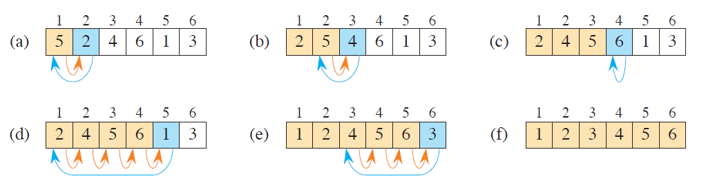

# **Insertion Sort**

The Insertion Sort algorithm builds the final sorted list one item at a time — like the way we sort playing cards in our hands.

- It starts by assuming the first element is already sorted.

- Then, it picks the next element and compares it to the elements in the sorted portion.

- It inserts the current element into the correct position by shifting the larger elements one step to the right.

- This process continues until all elements are placed in their correct position.

## **Visual Explanation of Insertion Sort**

The image below demonstrates how Insertion Sort builds the sorted portion of the list one element at a time by shifting larger elements to the right and inserting the current element in its correct position.



*Image source: Cormen, Thomas H., et al. “Introduction to Algorithms.” 3rd ed., MIT Press, 2009.*

## **Function:** `insertion_sort(A)`

Sorts the list `A` in ascending order, modifying the original list in-place.

**Example:**
```python
A = [9, 5, 1, 4, 3]
insertion_sort(A)
print(A)
# Output: [1, 3, 4, 5, 9]
```

## **Time Complexity**

- **Best case:** $O(n)$
- **Worst case:** $O(n^2)$
- **Average case:** $O(n^2)$

---

© 2025 Byron Velasco