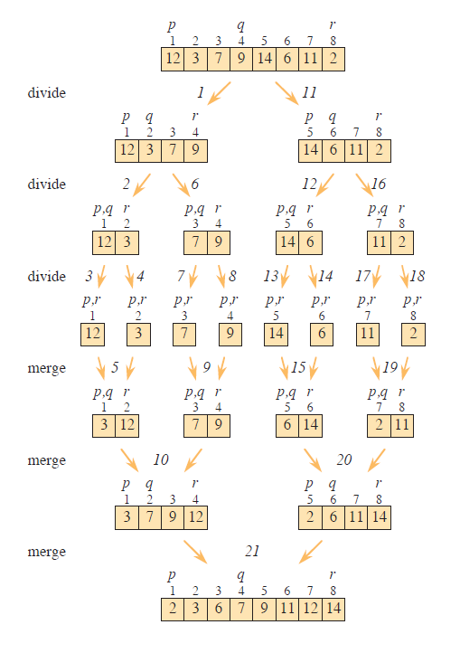

# MergeSort

This module contains the file `MergeSort.ipynb`, which implements the Merge Sort algorithm.

## Merge Sort Algorithm

The Merge Sort algorithm is a classic example of the divide and conquer strategy. It recursively splits the list into halves, sorts each half, and then merges the sorted halves to produce a fully sorted list.

- The list is divided into two halves until each sublist contains a single element.

- Each pair of sublists is then merged in a way that results in a sorted sequence.

- The merging process is repeated recursively until the entire list is sorted.

## Function: `MergeSort(A)`

Sorts (ascending) a list `A`. Changes the entire list `A` in-place.

**Example:**
```python
A = [38, 27, 43, 3, 9, 82, 10]
MergeSort(A)
print(A)
# Output: [3, 9, 10, 27, 38, 43, 82]
```

## Visual Explanation of Merge Sort

The image below illustrates how Merge Sort recursively divides the input list and then merges it back in a sorted manner.



*Image source: Cormen, Thomas H., et al. “Introduction to Algorithms.” 3rd ed., MIT Press, 2009.*

## Time Complexity

- **Best case:** $O(n \lg n)$
- **Worst case:** $O(n \lg n)$
- **Average case:** $O(n \lg n)$

where $\lg n$ means $\log_2 n$

---

© 2025 Byron Velasco
