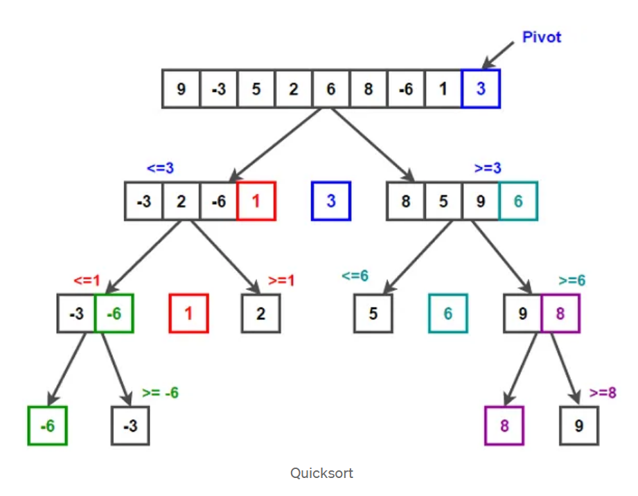

# QuickSort

This module contains the file `QuickSort.ipynb`, which implements the Quick Sort algorithm using a partitioning strategy.

## Quick Sort Algorithm

Quick Sort is a highly efficient, divide-and-conquer sorting algorithm. It works by selecting a **pivot** element and partitioning the array such that:

- All elements less than or equal to the pivot are placed on its left.
- All elements greater than the pivot are placed on its right.

This process is recursively applied to the left and right subarrays until the entire list is sorted.

## Functions Used

### `Partition(A, p, r)`

- The argument `p` is the index of the first element of the subarray to be partitioned.
- Takes the **last element** `A[r]` as pivot.
- Reorganizes the list so that the pivot is in its **correct final position**.
- Returns the index of the pivot.

### `QuickSort(A, p, r)`

- Recursively applies partitioning to sort (in-place) the list `A` from index `p` to `r`.

## Visual Explanation of Quick Sort

The image below shows how Quick Sort partitions the array around the pivot and gradually sorts it using recursive calls.



*Image source: [Latte & Code – Algoritmos de ordenación: QuickSort en JavaScript](https://latteandcode.medium.com/algoritmos-de-ordenaci%C3%B3n-quicksort-en-javascript-f064db39e6ad)*

**Example:**
```python
A = [2, 8, 7, 1, 3]
QuickSort(A, 0, len(A) - 1)
print(A)
# Output: [1, 2, 3, 7, 8]
```

## Time Complexity

- **Best case:** $O(n \lg n)$
- **Worst case:** $O(n^2)$
- **Average case:** $O(n \lg n)$

where $\lg n$ means $\log_2 n$.

---

© 2025 Byron Velasco
